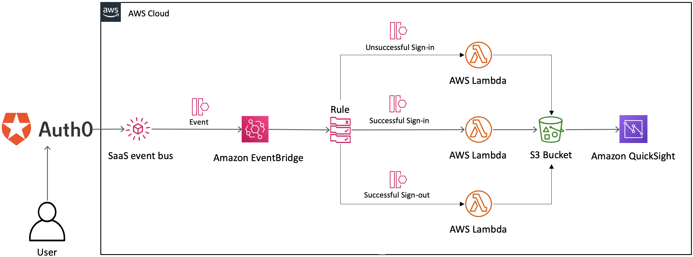

# eventbridge-integration-solution-auth0-visualization
## Visualize user behavior with Auth0 and Amazon EventBridge

This Quick Start demonstrates how to capture user events and monitor user behavior by using the Amazon EventBridge partner integration with Auth0. This enables you to gain insights to help deliver a more customized application experience for your users.

